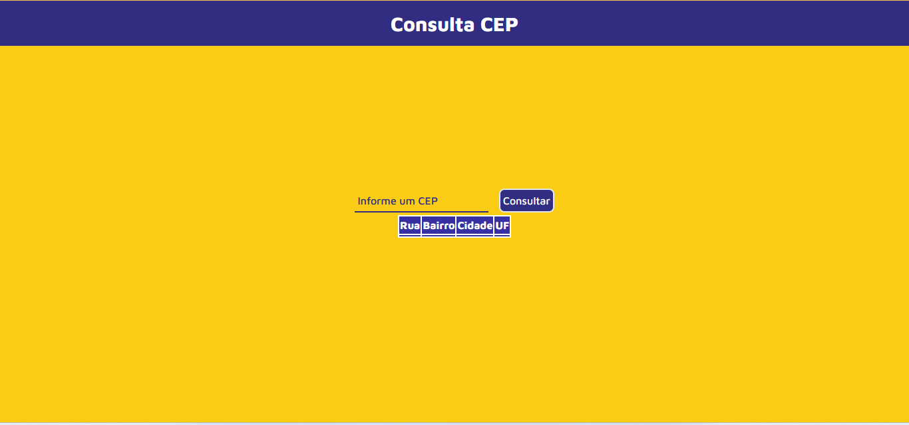
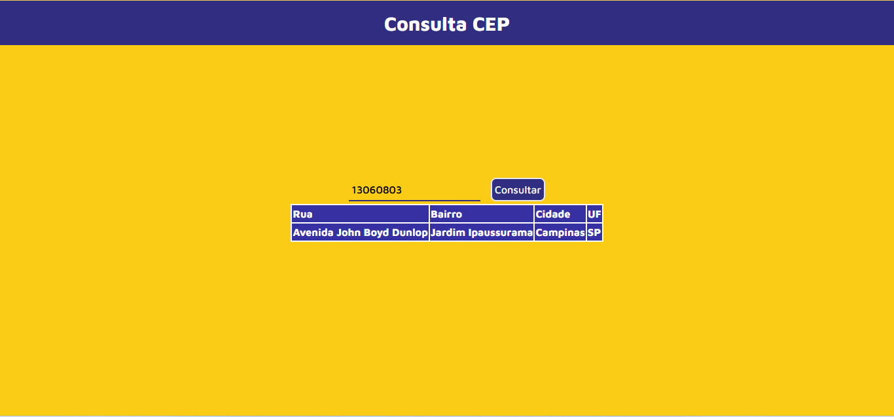
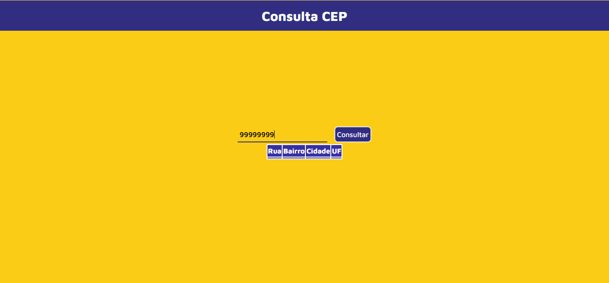
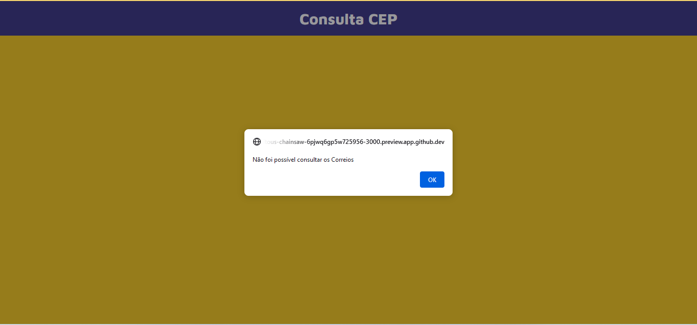

# Consulta CEP

Aplicativo de consulta de CEP

## Sobre

Este aplicativo foi desenvolvido para estudo de consumo de API. Recebe um CEP qualquer (no formato sem hífen) e retorna o endereço se a requisição HTTP for bem sucedida, se não, retorna um erro.

## Link Vercel
- [Link](https://appconsultacep.vercel.app/)

## Screenshots

### 1. Página

### 2. Inserindo um CEP válido

### 3. Resultado

### 4. Inserindo um CEP inválido

### 5. Resultado

## Referência

 - [CEP Brazil API](https://rapidapi.com/apis4all-apis4all-default/api/cep-brazil)

## Autores

- [@andre-dev-2021](https://www.github.com/andre-dev-2021)

